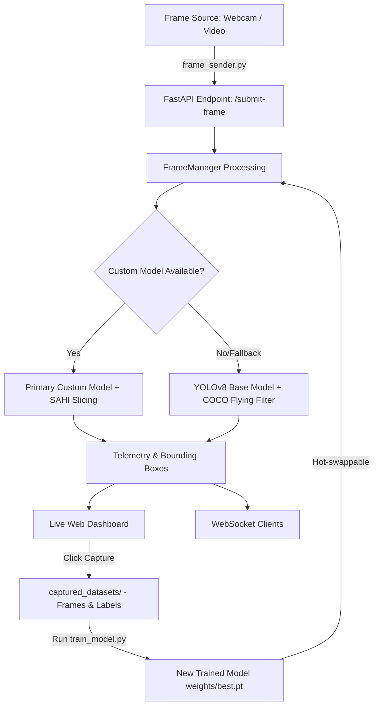

# 🛰️ Aerial Object & Drone Detection System

An enterprise-grade, real-time flying object detection and tracking system designed for defense and surveillance applications. The system leverages state-of-the-art deep learning architectures (**YOLOv8**) combined with Sliced Aided Hyper Inference (**SAHI**) to accurately detect and classify small, fast-moving aerial objects (drones, aircraft, helicopters, and birds) under diverse environmental conditions.

---

## ⚡ Core Features

- **Real-Time Detection & Classification**: Utilizes **YOLOv8** for high-throughput, low-latency identification of objects in live video feeds.
- **Tiny Object Detection via SAHI**: Employs slicing-aided inference to divide high-resolution frames into patches, significantly boosting accuracy for distant or micro-drones.
- **Robust Multi-Model Pipeline**: Automatically discovers and hot-swaps custom-trained model weights. Features a fallback mechanism using standard COCO weights to maintain tracking capability during initial training loops.
- **Interactive Live Dashboard**: Built on **FastAPI** and **WebSockets**, providing real-time telemetry, live MJPEG streams, system controls, and manual/automatic frame capture utilities.
- **Smart Data-Ingest System**: Supports webcam inputs and batch processing of video datasets (`mp4`, `avi`, etc.) using a distributed Frame Sender client.
- **Integrated Training Pipeline**: Complete end-to-end pipeline (`train_model.py`) that prepares training datasets, normalizes annotations to standard YOLO format, runs transfer learning, and generates performance validation metrics.

---

## 🏗️ System Architecture



---

## 🛠️ Tech Stack

- **Deep Learning**: PyTorch, Ultralytics YOLOv8, SAHI
- **Computer Vision**: OpenCV, Pillow, albumentations
- **Web/API**: FastAPI, Uvicorn, WebSockets, Jinja2 Templates
- **Data & Numerics**: NumPy, Pandas, Scipy, Scikit-Learn
- **Formatting & Logging**: Rich, Colorama, Python-JSON-Logger

---

## 📂 Project Structure

```
├── captured_datasets/       # Generated datasets, training splits, and model weights
│   ├── background_frames/   # Captured background/negative frames
│   ├── detected_objects/    # Annotated object captures (images + YOLO text files)
│   ├── training_data/       # Automated train/val/test split directory
│   └── training_results/    # YOLO training output weight files (best.pt)
├── input_dataset/           # Drop-box for raw videos to process
├── templates/
│   └── index.html           # Live Dashboard Web Application UI
├── config.yaml              # Central configuration (hyperparameters, paths, thresholds)
├── frame_sender.py          # Video stream client (webcam or video pipeline)
├── live_server_advanced.py  # FastAPI main application and inference server
├── requirements.txt         # Comprehensive project dependencies
└── train_model.py           # Training script for building custom models
```

---

## 🚀 Getting Started

### 1. Prerequisites
- **Python 3.8 to 3.11** installed.
- **pip** and **git** configured.
- (Optional) CUDA-compatible GPU + PyTorch CUDA installation for accelerated training.

### 2. Installation
Clone the repository and set up a virtual environment:
```bash
# Set up virtual environment
python -m venv .venv
source .venv/Scripts/activate  # On Windows: .venv\Scripts\activate

# Install dependencies
pip install -r requirements.txt
```

### 3. Running the Live Inference Server
Start the central FastAPI application. The server manages model inference and hosts the web interface.
```bash
python live_server_advanced.py
```
Open your browser and navigate to **`http://localhost:7000`** to view the live dashboard.

### 4. Running the Frame Sender Client
In a separate terminal, start streaming video inputs into the server:

* **Method A: Stream from Webcam**
  ```bash
  python frame_sender.py --webcam
  ```
* **Method B: Stream from a raw video file**
  ```bash
  python frame_sender.py --video "path/to/your/video.mp4" --fps 30
  ```

---

## 🎯 Model Customization & Training

To train a model tailored to your environment:

1. Use the **Web Dashboard** to capture frames:
   - **Continuous Capture**: Automatically saves frames when objects are detected.
   - **Manual Capture**: Saves frames for background negative samples or edge cases.
2. Run the automated data splitting and training pipeline:
   ```bash
   python train_model.py
   ```
3. The script will automatically split the captured dataset into `train/val/test` sets (70/20/10 split), compile the configuration, run training epochs, validate performance, and output a new model to `captured_datasets/training_results/custom_drone_detector/weights/best.pt`.
4. The server will dynamically detect and highlight this new custom model for hot-swapping in the UI.

---

## 🎨 Visualization Styling
Detected objects are classified and color-coded dynamically using defense-standard alert aesthetics:
- 🔴 **Drone**: Red `(0, 0, 255)` (Critical Target)
- 🟤 **Airplane**: Brown `(19, 69, 139)`
- 💗 **Helicopter**: Pink `(203, 192, 255)`
- 🟡 **Bird**: Yellow `(0, 255, 255)` (Non-Threat)
